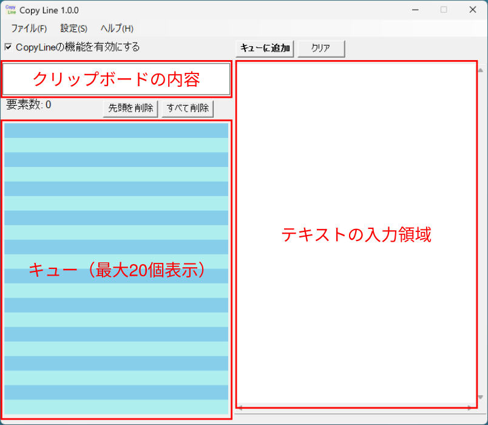
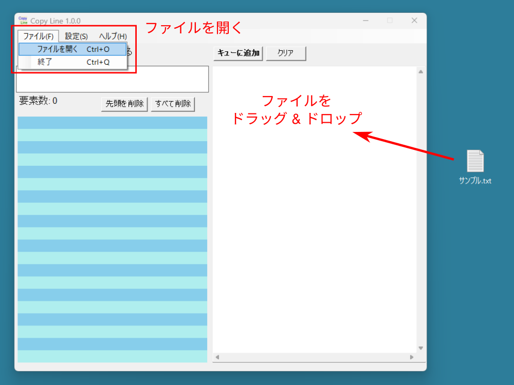
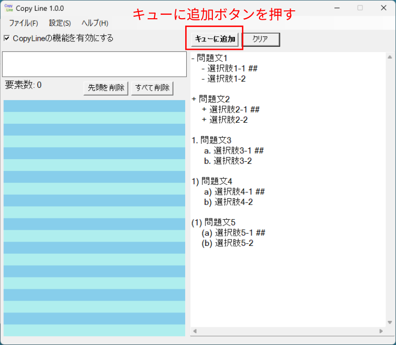
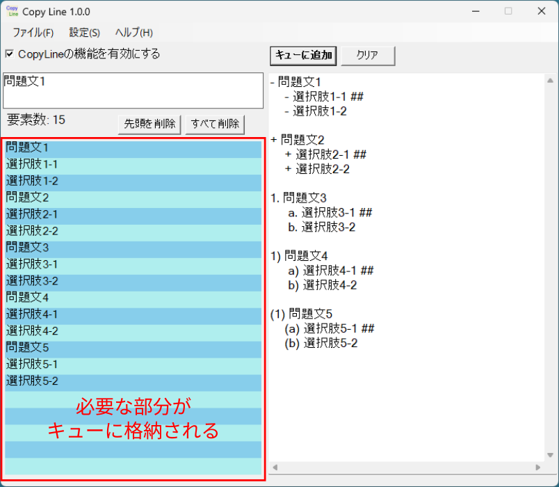

# copyline

## 概要
+ テキストボックスに入力したテキストの内容を1行ずつ正規表現で切り出してから
  クリップボードにコピーするためのプログラムです
    + `FIFO` (First In, First Out)「先入れ先出し」で貼り付けることができます
+ markdown 形式などで作成した箇条書き部分から必要な部分をコピーする場合に有用です

## ダウンロード方法
+ [Release ページ](https://github.com/toshi-ara/CopyLine-cs/releases)
  から `CopyLine.exe` をダウンロードして下さい
    + インストールの必要はありません


## 使い方
1. ワープロあるいはテキストエディタを使用して
   markdown 形式で箇条書きして下さい
    + markdown 形式でない場合でも使用可能です
2. `CopyLine.exe` を起動して下さい



3. 必要な部分をコピーしてテキストボックスに貼り付けて下さい
    + テキストファイルの場合には
      メニューの開く (Ctrl-O) あるいは
      テキストボックスにファイルをドラッグ & ドロップすることも可能です



4. **"キューに追加"** ボタンを押して下さい
    + **箇条書きのための記号や正答を示す記号を除いた部分**
      がキューに格納されます
    + キューの先頭要素がクリップボードに格納されます





5. 貼り付けたいアプリケーションに移動して
   Ctrl-V を押すとキューの上から順番に貼り付けられます
    + 右クリックメニューの貼り付けには対応していません
6. （新機能）キューに要素が残っている場合でも、
   Ctrl-C あるいは Ctrl-X でクリップボードの内容を変更すると
   Ctrl-V でその内容を貼り付けることができます
    + クリップボードの内容を示す枠がピンク色に変わります
    + 間違えた場所に貼り付けた場合に有効です
7. "CopyLineの機能オン" のチェックボックスをオフにすると
   通常のコピー & ペーストの動作になります

## 使用例
以下の例では
`問題文`、`選択肢1`、`選択肢2` がクリップボードにコピーされます

### 記号
`-`, `+`, `*` を使用できます。

```
- 問題文
    - 選択肢1 ##
    - 選択肢2
```

```
+ 問題文
    + 選択肢1 ##
    + 選択肢2
```

```
* 問題文
    * 選択肢1 ##
    * 選択肢2
```
### 英数字
以下のいずれの形式でも動作します。

```
1. 問題文
     a. 選択肢1 ##
     b. 選択肢2
```

```
1) 問題文
     a) 選択肢1 ##
     b) 選択肢2
```

```
(1) 問題文
    (a) 選択肢1 ##
    (b) 選択肢2
```

### 正答・誤答の指定
問題を作成するときに正答や誤答を追加したい場合があります。

この場合には、コピーしたい文字列（選択肢など）の後に
半角スペースあるいはタブを挟んで
`##`（`#`を1個以上連続させたもの）,
`○`, `×`を記載することができます。
この部分はクリップボードにコピーされません。

ただし`○`および`×`は機種依存文字を使う場合があるため非推奨です。

```
- 問題文
    - 選択肢1 ##
    - 選択肢2 ○
    - 選択肢3 ×
```

### 無視される行

+ 空行および `#` で始まる行
  （markdown では `#` で始まる行は見出しとして扱われるため）
+ (begin) および (end) タグ（copyline.vim との互換性）
+ 正規表現で切り出された結果、半角スペースになる行


## 開発のきっかけ

VS Code あるいは Vim で同様の拡張機能を作成していましたが、
このときは [Clibor](https://chigusa-web.com/)（クリップボード履歴フリーソフト）
を併用していました。
ただし、導入および設定に手間がかかるため、
FIFOの機能を実装したプログラムを作成したいと考えており、
今回ようやく開発することができました
また、実行ファイル1つだけで済むため、導入が非常に楽になりました。


## Release Notes
### 1.0.0 (2025-02-21)
最初のリリース

